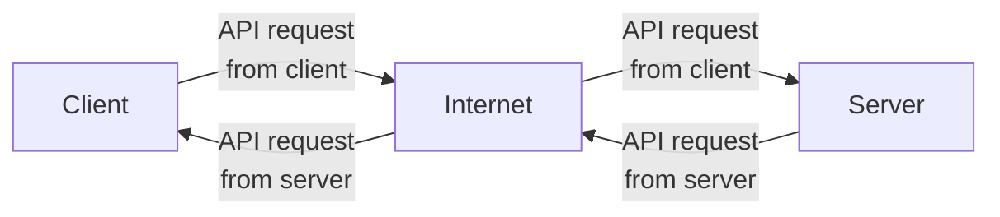

# boggle-server

This is the server for the [Boggle](https://github.com/TheOmnimax/boggle_flutter) app.

## About

This server is used to play online Boggle games between multiple players.

It uses Flask through FastAPI to create a REST API, which checks in with players using polling. It is hosted using Google App Engine.

For every game, a Boggle board is generated, and a list of every possible word on that board is generated. This is used to determine if a player's word is valid, and at the end, the list of missed words is sent to the players. The words are found using a depth-first search while traversing a word trie. The word trie was generated using [this word indexer](https://github.com/TheOmnimax/word-indexer) (also by me).

## Documentation files

Documentation files can be found in [this folder](https://github.com/TheOmnimax/boggle-server/tree/main/docs).

**[data_flow](https://github.com/TheOmnimax/boggle-server/blob/main/docs/data_flow.md)**: Graphs describing the data workflow.

**[directories](https://github.com/TheOmnimax/boggle-server/blob/main/docs/directories.md)**: Overview of the (directories) folders used in this server.

## System diagram

## Future improvements

Possible improvements for the future:

* Allow to start new game without refreshing page
* Implement WebSockets instead of REST API polling for a faster experience.
* Save game data using Google Datastore instead of memory for better reliability.