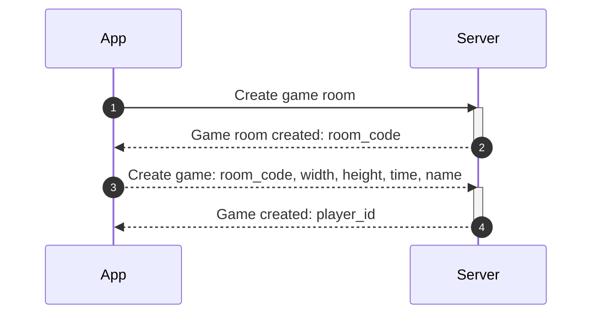
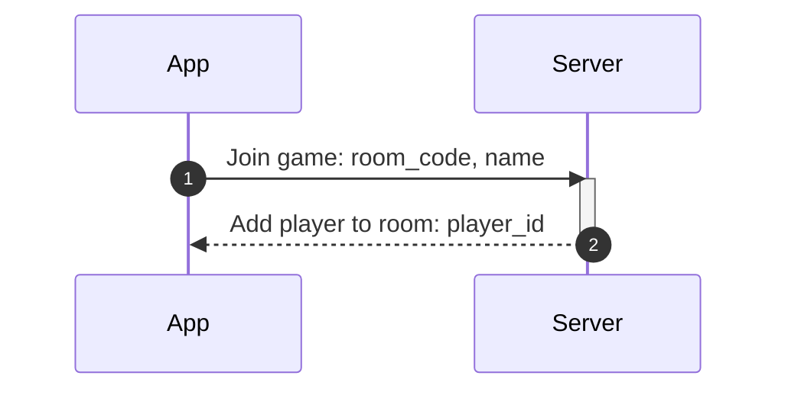
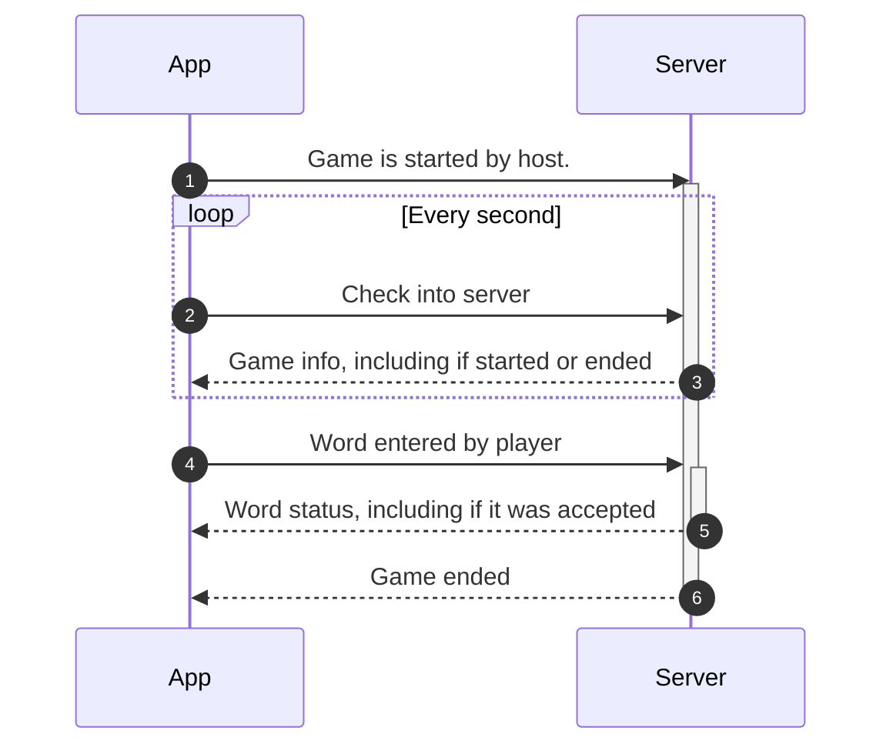
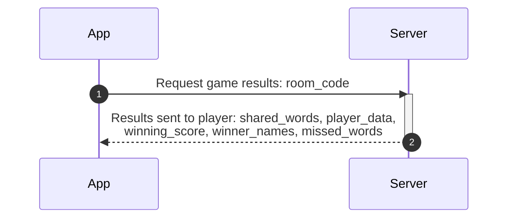

# Sequence diagrams

A solid line is an action initiated by the player, and a dotted line is an action initiated automatically by the app or the server.

## Game creation

Note: When the app is told that the game room has been created, it will automatically then request the game itself being created, without any prompting from the user.

## Join game

## Playing game

## Get results

