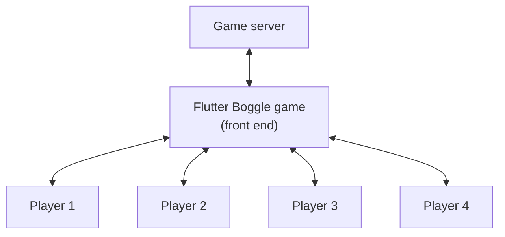

# High-level architecture diagram

```mermaid
flowchart TD
  Server[Game server] <--> FE["Flutter Boggle game<br>(front end)"]
  FE <--> P1[Player 1]
  FE <--> P2[Player 2]
  FE <--> P3[Player 3]
  FE <--> P4[Player 4]
```